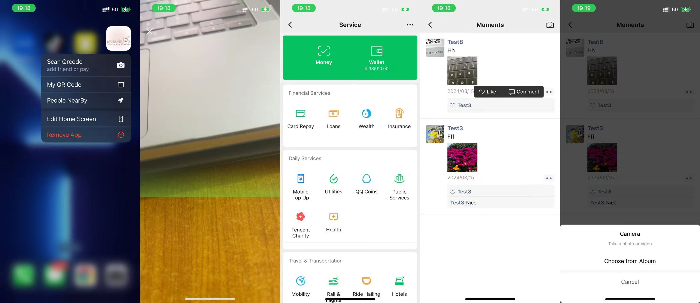

demo video is below

https://www.bilibili.com/video/BV1kW421A7Fh
a real-time chat app.

github give it a star if u like it!
https://github.com/zero19124/wechat-clone-v2
-feature
-page
fn

## preview

## features




### chats

-chat
texing, img, voice, emoji,transfer,recall,location pin,video<br>
taking pic or video to send (video autio compress)<br>
key panel<br>
video call<br>
msg recall<br>
recall only the themself can recall<br>
transfer<br>
-accept page<br>
-Location Sharing(real time by socket)<br>
animated locating<br>
relocate mock<br>
-\*voiceMsg animated effect
voice msg smooth change and autofocus details of (duration)<br>
check the voice and send<br>
cancel<br>

- \*Group Chats
  create groups<br>
  cant repeat create or join same one<br>
  memberList<br>

### contacts

-friendsList<br>
-add friends<br>
add by qrcode<br>

- search friend<br>
  friend status controll<br>
  \*index bar effect<br>

### discovery

-moments<br>
post pics or video<br>
take a photo or video<br>
like or comment<br>
who can see<br>
-People NearBy<br>
online status<br>
say hi<br>
relocate<br>

### me

-wallet<br>
login<br>
google-login<br>
-register<br>
-qrcode<br>
-setting<br>
i18n<br>
theme<br>
-others<br>

### others

1 quick action<br>
2 img detect qrcode<br>
3 make a transfer or add friend by qrcode<br>
4 save money qrcode and personal qrcode to album and make features above via qrcode<br>
9 Push notifications<br>
10 user online status<br>
compare with real wechat on iphone<br>

### Start the app

```shell
npm i  &&

npx expo

```

add google map key
<meta-data
     android:name="com.google.android.geo.API_KEY"
     android:value="Your Google maps API Key Here"/>
